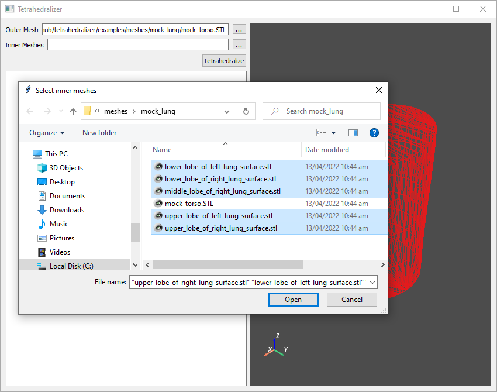
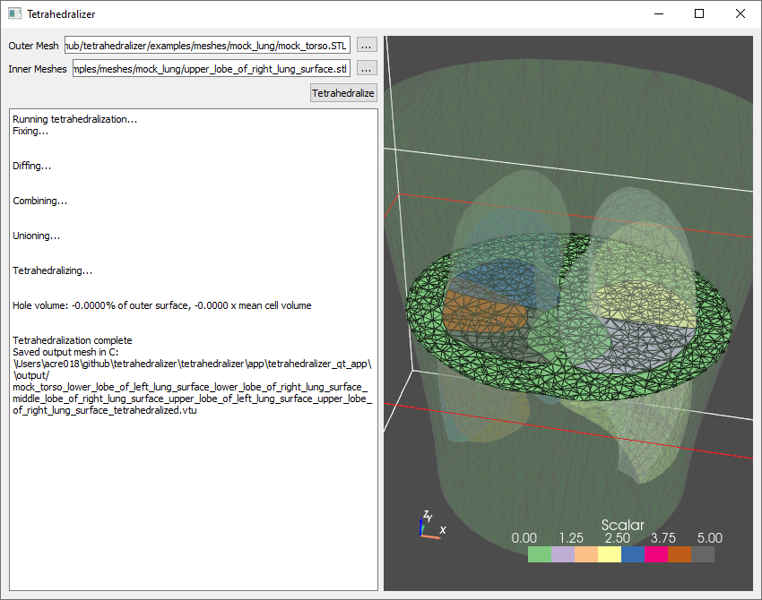

===============
Tetrahedralizer
===============
Tetrahedralizer is an app and python library for automating the process of converting
surface meshes to volumetric meshes.

Documentation is available at: https://abi-eit.github.io/tetrahedralizer/

.. image:: _static/Tetrahedralizer_app_1.png

Tetrahedralizer is able to create a constrained tetrahedralization from any number of input
surfaces defining the boundaries of sections within the output mesh. The output mesh is saved
in a .vtu file (VTK unstructured grid) which preserves the individual sections and can be
easily imported into other programs for further processing. The entire process is configurable
through a user editable configuraiton file.

The individual features are also available to use through the Tetrahedralizer API.

Features
--------
* Mesh fixing with PyMeshfix
* Removal of shared mesh faces
* Boolean operations with PyMeshlab
* Tetrahedralization with gmsh
* Visualization with PyVista
* Automated tetrahedralization of multi-surface meshes

Installation
------------
Installation of Tetrahedralizer requires that you have python_ installed on your computer.
Once python is installed type the following command into your terminal:

.. code-block:: console

    $ pip install git+https://github.com/ABI-EIT/tetrahedralizer

To install the GUI app, run:

.. code-block:: console

    $ python -m tetrahedralizer --install tetrahedralizer_qt

This will create a folder containing the installation of the Tetrahedralizer GUI
app in your current directory. Run the app using tetrahedralizer_qt.exe contained within this folder.

.. _python: https://www.python.org/

Quick Start
-----------
To use the Tetrahedralizer app, simply select one outer mesh, representing the outermost boundary
of the desired output mesh, then select any number of inner meshes, representing the boundaries of inner
sections of the output mesh:

|select_outer| |select_inner|

Click Tetrahedralize, and the automated process will begin, with
progress displayed in the text box on the left had side of the screen. When finished, the
resulting tetrahedralized mesh will be saved as a .vtu file in the output directory of the
Tetrahedralizer installation:

|in_progress| |done|

Credits
-------
* Development Lead: Andrew Creegan <andrew.s.creegan@gmail.com>
