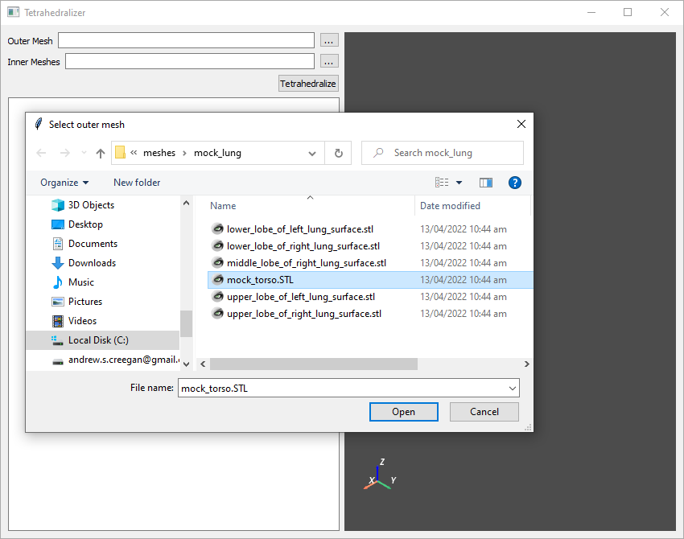
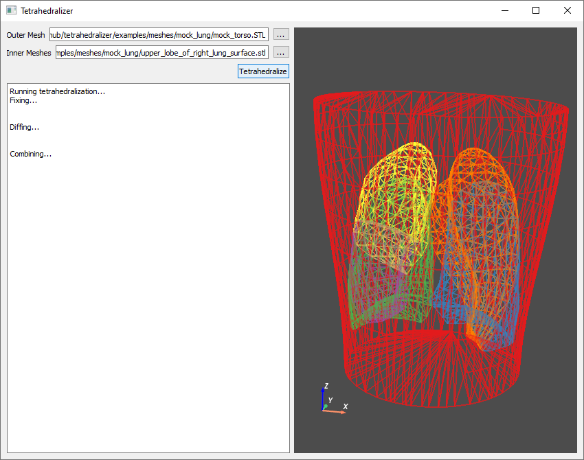
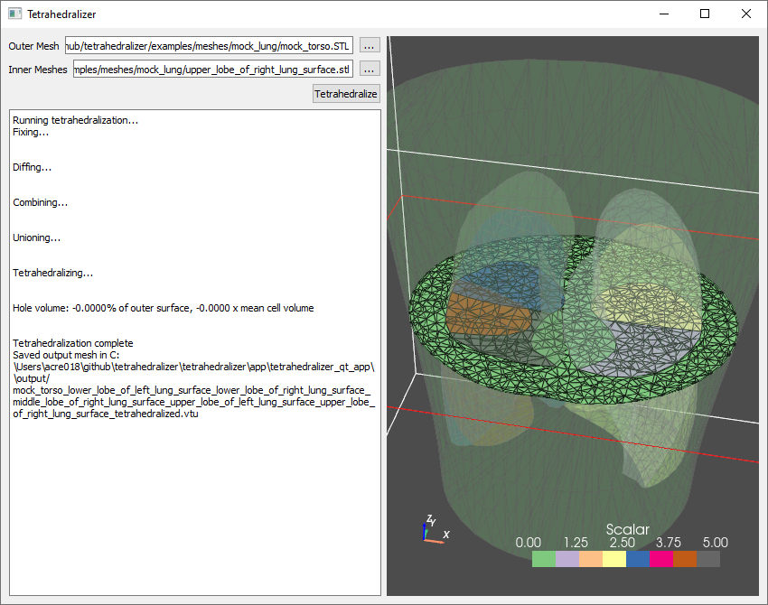
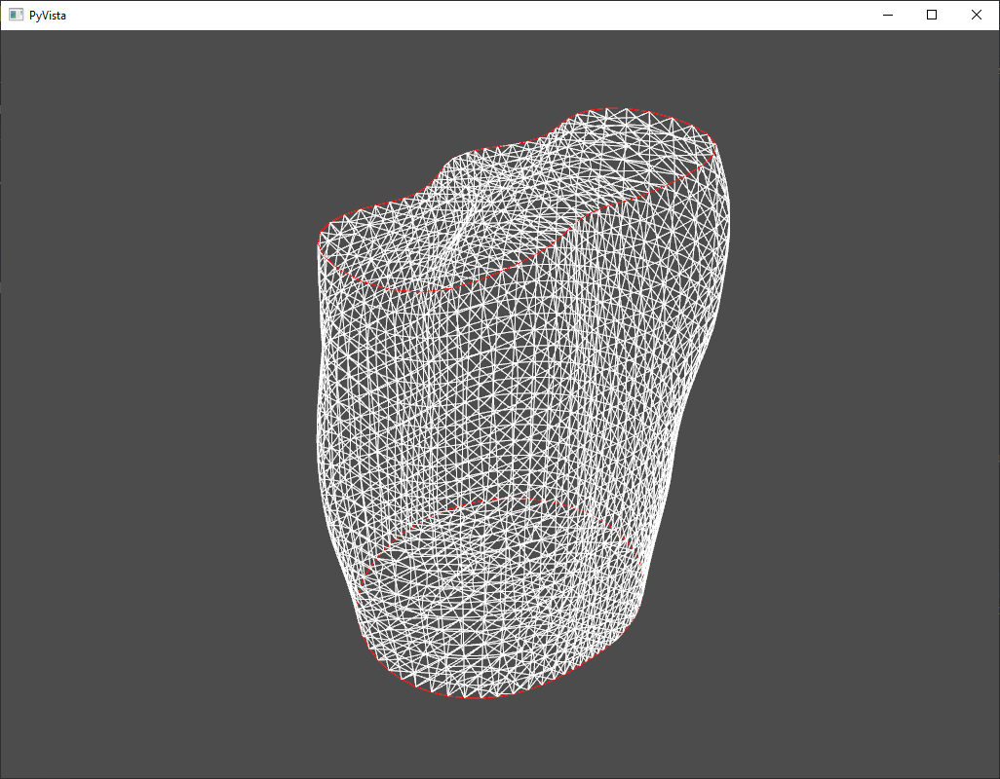
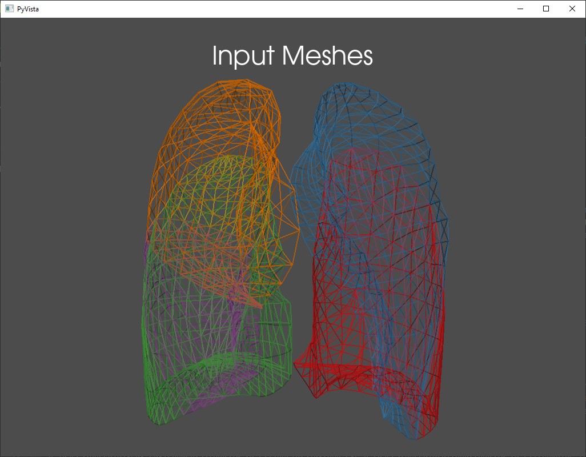
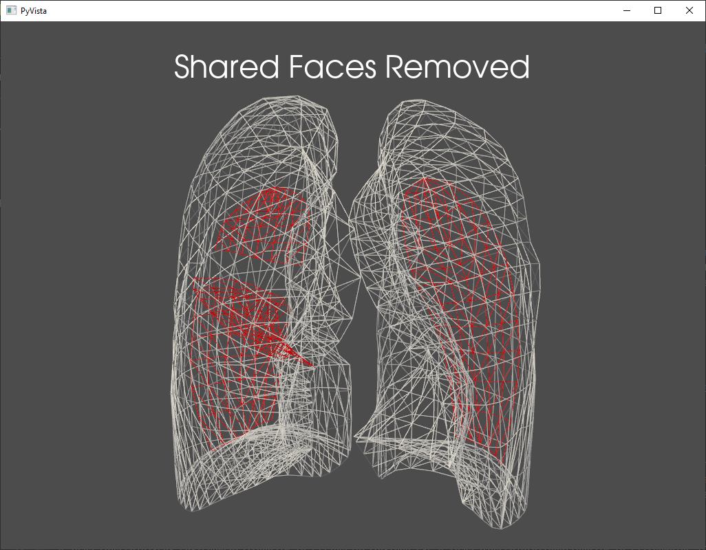
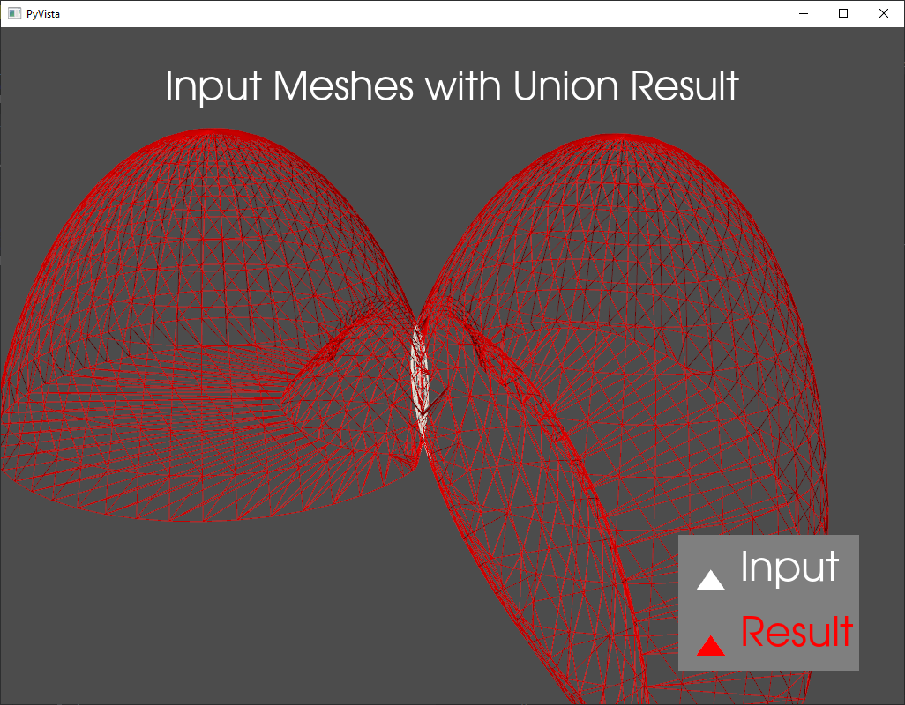
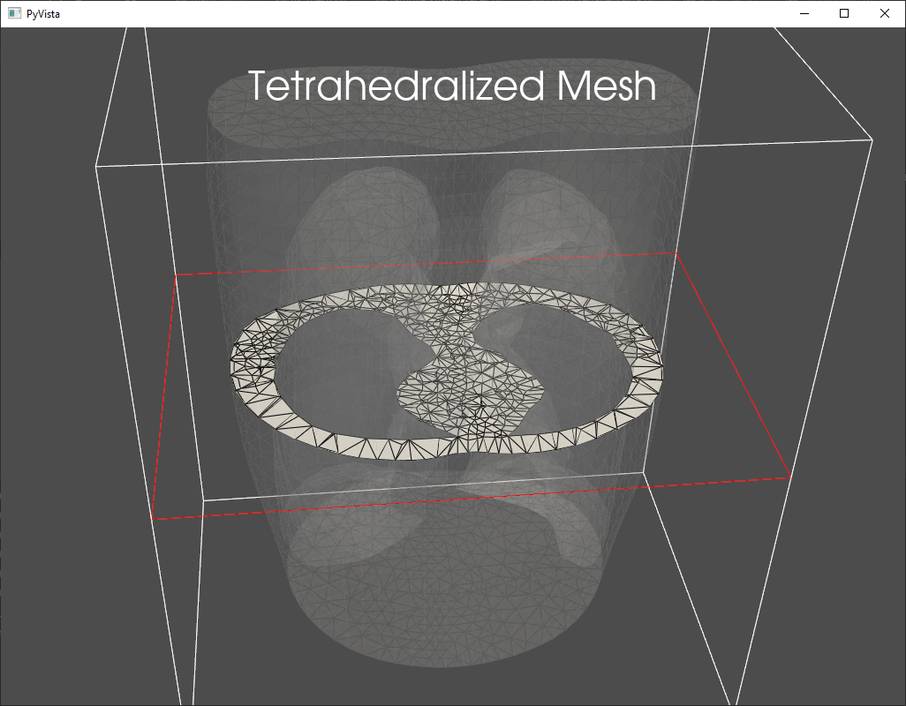
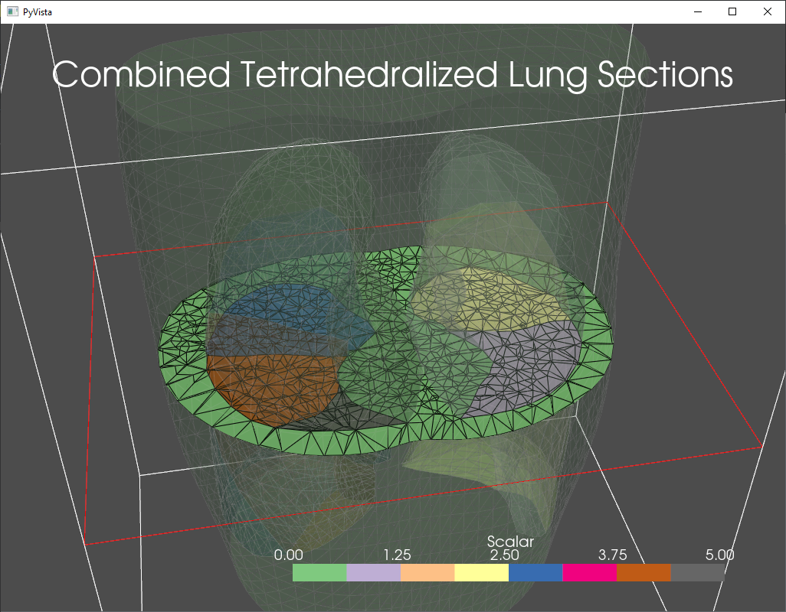

==========
User Guide
==========

GUI App
-------
To use the Tetrahedralizer app, simply select one outer mesh, representing the outermost boundary
of the desired output mesh, then select any number of inner meshes, representing the boundaries of inner
sections of the output mesh:

|select_outer| |select_inner|

.. |select_inner| image:: _static/select_inner_meshes.png
    :width: 45%

Click Tetrahedralize, and the automated process will begin, with
progress displayed in the text box on the left had side of the screen. When finished, the
resulting tetrahedralized mesh will be saved as a .vtu file in the output directory of the
Tetrahedralizer installation:

|in_progress| |done|

Configuration
*************
The tetrahedralization process in the tetrahedralizer app is configurable using the conf.json file in
the app install directory. The default configuration file is shown below:

.. code-block:: json

    {
      "output_suffix": "tetrahedralized",
      "output_directory": "output",
      "output_extension": ".vtu",
      "mesh_repair_kwargs": {},
      "gmsh_options": {
        "Mesh.MeshSizeMax": 10
      }
    }

**mesh_repair_kwargs** refers to kwargs given to the Pymeshfix Meshfix.repair function.

**gmsh_options** is a dictionary of values passed to gmsh.option.set_number.

API Features
------------
Automated tetrahedralization of multi-surface meshes
****************************************************
The GUI app implements the API function *preprocess_and_tetrahedralize*, which is a pipeline to
automatically create a tetrahedralization from multiple input surface meshes: one outer mesh, representing the outermost boundary
of the desired output mesh, and any number of inner meshes, representing the boundaries of inner
sections of the output mesh. The process is as follows:

- Run meshfix on each input mesh
    This is done to ensure manifoldness of the surfaces. It is reapeated after each step

- Boolean operations
    The input meshes are used twice in the proces. Once to generate holes in the tetrahedralization of the
    outer mesh, and once when they are tetrahedralized individually. For the first operation, a boolean
    union is created from the inputs to represent the combined outer surface of the inner meshes. For
    the second, a boolean difference to create a set of non-intersecting inner sections.

- Remove shared faces
    Meshes which have faces which exactly overlap (i.e. zero volume intersection) require this special
    operation when creating the combined outer surface of the inner meshes with which to generate
    the holes in the outer mesh.

- Tetrahedralizing
    The gmsh tetrahedralization operation is used on the outer mesh with holes and each inner mesh
    individually

- Combining
    The inner tetrahedralized meshes are combined with the outer to generate the final result.

Mesh fixing with PyMeshfix
**************************

|not_fixed| |fixed|

.. |not_fixed| image:: _static/torso_not_fixed.png
    :width: 45%

Removal of shared mesh faces
****************************

|input| |shared_removed|

Boolean operations with PyMeshlab
*********************************

Tetrahedralization with gmsh
****************************

|holes| |all_lobes|

